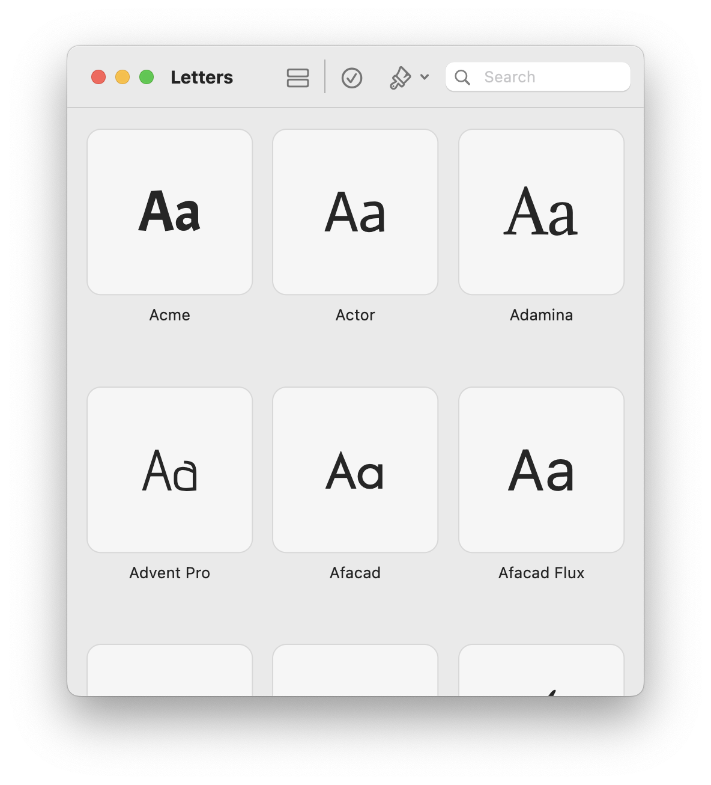
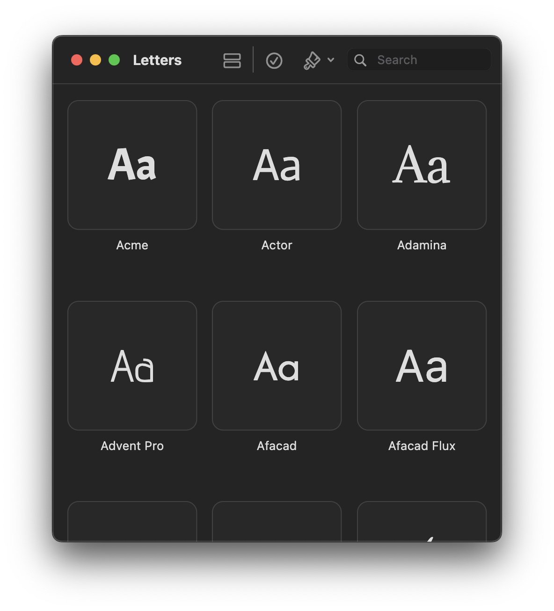

# Letters ** 
a simple, open source font manager for macOS. It allows you to preview and install fonts on your system. It is built with Flutter and offers access to Google Fonts. 

You can learn more about it on my personal website [here](https://apps.robbb.in/letters).

### Screenshots 
**
**

### Install
1. download the `Letters.app` file from the Releases sidebar
2. put it into your `Applications` directory

### Contribute
The app is written in Flutter, so it should be relatively easy to port it to other OSes. (The UI might be the biggest challenge) I currently don't have time to do work on it, but if you'd like to give it a shot, feel free to reach out :D

### Feedback
The app provides a feedback option (on the top left) which you can use to send ideas or feedback. I'm always happy grateful for feedback! Otherwise, feel free to message me here or open an issue

Yours, Robin

